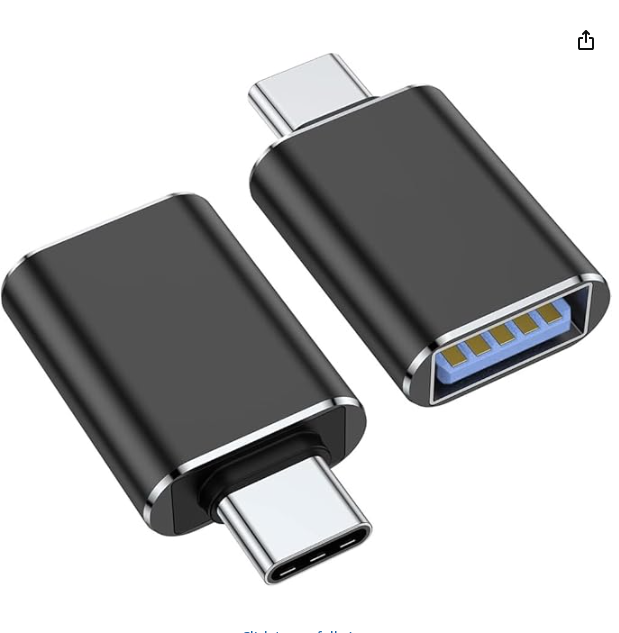

Shortcut to [today's assignment](homework.md#todays-assignment)  
Shortcut to [today's lecture](lectureNotes.md#todays-lecture)  
Shortcut to [play
script](https://docs.google.com/document/d/1j0KADb83ufT4OnbhTfyRpN-7AbmNvH17S0KhKeWV_Zc/edit?tab=t.0)  
Shortcut to [research presentations](https://docs.google.com/spreadsheets/d/1H67fPcgNpJAw_h9IF7Uh4UINfpykP3S3smrm_njblvk/edit?usp=sharing)

#### New York University Abu Dhabi  
#### Interactive Media Program

* Course Information
    * Course Code and Number: IM-UH 3117  
    * Course Title: Performing Robots
    * Credit Hours: 4     
    * This is a 14 week course consisting of fourteen 75 minute meetings and
      fourteen 150 minute meetings
    * Instructional time requirements are met by the scheduled meeting times
    * Class location: C3-029 (IM Lab in the Art Center)
    * Prerequisites: IM-UH 1010 or INTM-SHU 101 Interaction Lab or IMNY-UT 101 Creative Computing or DM-UY 1133 Creative Coding
* This course counts toward the following NYUAD degree requirements:
    * Majors > Interactive Media
    * Majors > Interactive Media > Physical Computing 
    * Minors > Interactive Media
* Faculty Details
    * Professor: Michael Shiloh mshiloh@nyu.edu   
    * Office hours: Schedule an appointment [here](https://calendly.com/michaelshiloh/office_hours)
    * Office phone number: 02-628-5185
    * Office location: C3-156

* Session: Fall 2025       
* Meeting times:    
	- 3:20-4:35 Tuesday
	- 3:20-6:00 Thursday

* Course website: [https://github.com/michaelshiloh/PerformingRobots](https://github.com/michaelshiloh/PerformingRobots)  

### Assignments Due Thursday August 28 Week 1

Bring to next class Assignment:

- If you have a modern laptop with only USB-C ports, you will need a USB-C to
  USB-A adapter, something like this: 

Outfit Assignment:

- Next week you will be doing tool training. For this you need to dress
  properly:
  - Closed toed shoes
  - No loose clothing (smocks can be provided)
  - No necklaces or bracelets or other dangling jewelery
  - Expect to get dusty (sawdust, metal shavings)

Email Assignment:

- Join Discord
- Create a Github account, if you do not have one. Instructions are
  [here](https://github.com/michaelshiloh/resourcesForClasses#github-resources)
- Create a repository called "performingrobots" in your Github account. 
- Send me email with:
    - A link to your github *repository* (not the account!!!!)
    - Discord screen name 

Reading Assignment:

- Review or learn the following:
    - What is an Arduino
    - How to use `setup()` and `loop()`
    - How to use the `digitalWrite()`, `digitalRead()`, `analogWrite()`, and
      `analogRead()` functions
    - How to use the internal pullup resistors
    - How to wire up a switch and an LED on a solderless breadboard
    - How to use the `if ... else` construct
    - How to use an L298 H-bridge to control the direction and speed of a
      motor

There are millions of resources on the web. Here is a short list or find your
own:
- Breadboard
    - Video: https://www.youtube.com/watch?v=6WReFkfrUIk
    - Text: https://www.build-electronic-circuits.com/breadboard/
- Switches
    - Video: https://www.youtube.com/watch?v=ChHNI8yt69g
    - Text:https://learn.sparkfun.com/tutorials/button-and-switch-basics/all#:~:text=A%20switch%20can%20only%20exist,piece%20of%20perfectly-conducting%20wire.
- LEDs
    - Video: https://www.youtube.com/watch?v=I0ZIrzoI61g
    - Text: https://learn.adafruit.com/all-about-leds/overview
- Analog/Digital Input/Output
    - Video:
        - https://www.youtube.com/watch?v=cmc-BPtkdAU
        - https://www.youtube.com/watch?v=JwpBn1mPGMc
        - https://www.youtube.com/watch?v=8bufqdXwCpY
    - Text: 
        - https://arduinofactory.com/arduino-language-analog-pins-analogwrite-and-analogread/
        - https://arduinofactory.com/arduino-language-digital-pins-digitalwrite-and-digitalread/
- If… else
    - Video: https://www.youtube.com/watch?v=YktSocf2vSc
    - Text: https://docs.arduino.cc/built-in-examples/control-structures/ifStatementConditional/
- While Loop
    - Video: https://www.youtube.com/watch?v=ECHFxmKUDFQ
    - Text: https://www.sparkfun.com/news/2399
- L298 H-bridge
    - https://deepbluembedded.com/arduino-l298n-dc-motor-driver-interfacing-tutorial/
    - https://lastminuteengineers.com/l298n-dc-stepper-driver-arduino-tutorial/
    - https://howtomechatronics.com/tutorials/arduino/arduino-dc-motor-control-tutorial-l298n-pwm-h-bridge/

### Assignments Due Thursday September 11
1. Finish mounting the caster wheel and the two motors to your wooden
   platform. You can use the tools in the IM lab whenever it is staffed,
   either by Dustin or a lab assistant. 
	1. Be sure to clean up after yourselves.
	1. Obey safety protocols
	1. Wear closed toed shoes and safety glasses
	1. Dress properly: hair tied back, no loose jewelery or clothes, etc.
1. Since we will be doing a lot of fabrication in this class, I suggest that
   you always dress appropriately.
1. We need to start working on the play. Please bring to class **two**
   concepts for plays.

### Assignments Due Tuesday September 16

#### Play
Create an outline of the play consisting of at least five scenes. For each
   scene, list the characters involved and summarize the scene. Typically, all
   characters will be in the first and last scene: 
1. Beginning scene (sort of an introduction)
1. Intermediate scene A
1. Intermediate scene B
1. Intermediate scene C
1. Final scene (wraps up any loose ends, closes the play)

#### Arduino
1. Refresh your memory of how to use **arrays** in Arduino. Use any resource you
   like, such as
   [this](https://docs.arduino.cc/language-reference/en/variables/data-types/array/)
   or
   [this](https://docs.arduino.cc/built-in-examples/control-structures/Arrays/).
   If you find a different resource that you find particularly useful, please
   post it on our Discord channel.
1. Read [this](https://ece353.engr.wisc.edu/firmware-basics/interrupts/) very basic introduction to **interrupts**. 
1. Read [this](https://ryanboland.com/blog/reading-rc-receiver-values)
   description of using the **EnableInterrupt** library to read the signals
   from a Hobby RC radio receiver

#### Soldering
Read the first two of the following
guides on soldering, and watch the third video between 0:17 and 0:28 seconds.
Play the video over a few times and pay careful attention. 
- Note how the solder **sticks to both the pin and the round pad on the
  circuit board.**
- Note that **only just enough solder is used**, so as not to create
  an unwanted connection (a *short circuit*) between two pins.

Soldering Resources [here](https://github.com/michaelshiloh/resourcesForClasses/tree/master?tab=readme-ov-file#soldering)

### Assignments Due Thursday September 18
1. Create an outline of the play 
1. Before class, one person from each team should go to the Equipment Center
   (near the Project Space) and check out the RadioLink RC4GS kit with the RC transmitter,
   receiver, batteries, and battery charger. 
1. Dress appropriately for working in the IM fabrication area

### Assignments Due Tuesday September 23

- Finish attaching the Arduino, L298 H-bridge, and battery to your robot base
- Drill holes in based to allow the wires from the motors to come to the top
- Extend the motor wires by soldering. If your soldering looks excellent, and
  if you know how to use heat shrink tubing, you may insulate your solder joint
  with heat shrink tubing. If you are unsure, leave your wires exposed until I
  can inspect them (Monday or in class).
- Charge all six of your AA batteries for the RadioLink RC4GS transmitter

### Assignments Due Thursday September 25
#### Soldering

Make some progress on the soldering work we discussed today. I have
added
more [detailed
notes](https://github.com/michaelshiloh/PerformingRobots/blob/master/lectureNotes.md#soldering-wires-between-l298-breakout-board-and-hobby-rc-and-motor-controller-shield) in the lecture notes. I will try to add pictures too.
Watch the videos first.

### Assignments Due Tuesday September 30

#### Robot base
Finish your robot base. That includes:
- All wiring
- Pair your radio transmitter and receiver
- Combine the code for controlling the motors with the code for reading the
  radio signals. At the very least:
  - Robot can move forwards and backwards by remote control at a fixed speed
- Bonus:
    - Add the ability to steer your robot i.e. to make turns
    - Add the ability to vary the speed

#### Research Presentations
- Presentations will happen on Tuesdays
- We will have three presentations per day
- Select a date for your presentation on the 
  [same](https://docs.google.com/spreadsheets/d/1H67fPcgNpJAw_h9IF7Uh4UINfpykP3S3smrm_njblvk/edit?usp=sharing) list

#### Research topics
In groups of two, choose two research topics on which you will give a
presentation: 1) a team or individual creator (artist, designer, engineer) who
creates robotic performers or performances and 2) a machine or device that is
a robotic performer. You can define the word "robot" quite broadly, but it
must have a physical presence and physically interact with the world outside
of a computer screen.
- Do not work with your robot partner
- Choose a different group of two for each presentation
- In-depth, serious research, analysis and critique are required. Your
  presentation must not simply be a collection of facts. Use the library and
  the writing center. I will provide more detailed guidelines.
- You may find some inspiration in these
  [references](https://github.com/michaelshiloh/PerformingRobots/blob/master/references.md)
  or in these
  [resources](https://github.com/michaelshiloh/resourcesForClasses). 
- Enter the names of your chose topics in
  [this](https://docs.google.com/spreadsheets/d/1H67fPcgNpJAw_h9IF7Uh4UINfpykP3S3smrm_njblvk/edit?usp=sharing)
  list. If a topic is already chosen, you must choose another. After your
  presentation, add a link.
- Presentation can be of any form. 

### Assignments Due Thursday October 2

1. Build the basic frame of your robot body. It must be at least 1.5 meters
   tall. It does not need to be detailed or have any limbs or additional
   features. Contact me via Discord if you need any additional materials or
   have questions.
1. From now on you will document your work. Create a file in your Github
   repository called `journal.md`. Create a dated entry and add some pictures
   of you creating your robot body. 

### Assignments Due Tuesday October 7
1. The frame of the torso of your robot should be substantially complete. What
   this means exactly will vary for each one of you. I want to see the basic
   shape of your robot. Heads, limbs, or other appendages are not necessary.
   Clothing or other visual treatment is not necessary.
1. On Tuesday I would like to start attaching servo motors to your robots.
   Therefore, I would like each robot to have one potential site for a servo
   motor constructed and ready for a motor. This could be for an arm or other
   appendage, or for hair or a cigar or whatever. The important thing is that
   there is some wood ready to which to attach the servo motor bracket. 
1. As always, document your work in your journal.md

#### Notes
- As requested, I have changed the presentation schedule so that we will start
  on October 21 and end on November 18. There are three slots open, which
  means that three groups have not added themselves to the schedule. Please
  complete this.
- Three groups (Mariam and Jiho, Ghadir and Aysha, Torico and Jiho) have not
  yet chosen a topic. This was due on September 30 so you are late. Please
  complete this.
- I am available over the weekend if you need parts or assistance with your
  robot, but only if you message me early enough. 

### Assignments Due Thursday October 9
1. Each team should have one servo motor attached to the body of their robot.

### Research presentations start on Tuesday October 21
#### Guidelines for Research Presentations
- Apply critical media concepts and context by analyzing and critiquing the work
  in cultural, social, historical, ethical, and aesthetic contexts.
- Include **original** (this means that you wrote it) analysis and opinion
- In the case of a team or individual creator (artist, designer, engineer,
  etc.), carefully research their entire body of work, and describe their 
  ethos, thinking, motives, and artistic positions.
- In the case of a machine, device, or project that is a robotic performer (where the
  word "robot" can be defined quite broadly)
    - Carefully research the goals,
  thinking, ethos, and artistic positions of the creator(s) and describe it
  in the context of this particular device.  
    - Describe the critical and
  conceptual framing of the project.
    - Provide a formalized opinion (your own) about this work
    - Describe how this work was made
    - Describe  what technology was used
    - Describe how the technology informs the concept of the work
- Your presentation must:
    - Be around 15 minutes with an additional 5 minutes for questions
    - Be linked in
      [this](https://docs.google.com/spreadsheets/d/1H67fPcgNpJAw_h9IF7Uh4UINfpykP3S3smrm_njblvk/edit?usp=sharing)
      document, allowing everyone access
    -  Include everyone's names
    -  Have a title
    -  Contain images, video or sound recording, or links to same, as
       necessary and **relevant**
    -  Be designed professionally:
        - Communicates your idea effectively
        - Considers aesthetics
        - Doesn't repeat itself, or include pointless sentences that don't
          convey any information
        - Shows evidence of attention to detail (spelling, grammar,
          consistency, formatting, etc.)
    -  Concludes with key prompts for conversation. What questions do you have
       having done this research? 
- Review the
  [Guidelines for a writing a Reading
  Response](https://docs.google.com/document/d/1xj8PSNpghJoQFhTP8wPr7B1zJvqIOD_KqPtYluU3LXs/edit?usp=sharing)
  and the [How to Read for
  Writers](https://docs.google.com/document/d/1-FC6QJkknB4KRuUrrVPrvB2u_X4F-QYIK0SG9ieIs3s/edit?usp=sharing)
  for more suggestions. Since these are aimed at readings responses, consider
  how to apply this to your presentation.

### Midterm evaluation Due Thursday October 23
- Sarah and Torico:
    - Connect the body and base, which we believe is essential for testing
      the arms and cable routing.
    - Connect the head and body, focusing on the internal support
      structure.
    - Complete two arms and control both arms using two motors.
- Ali and Hari
    - finish the code for the arms + face servos ( 7 in total)
    - LED eyes
    - Close the back by attaching the cardboard cutout of the back with
      styrofoam to fill the gap and give its structure and  some strength. 
    - Attach the legs 
    - Head: styrofoam ball to fit the space left on top of the robot face
- Meera and Victor
    - Crank attached and functioning
    - Complete the full body of the robot 
    - Redo the cutouts to get access to the wires
    - Lights on top of the robot 
- Clara and Jiho
    - attach lower body to the wheel base
    - attach the lazy susan and giant servo motor
    - build the upper body
    - upper body controlled by the giant servo with Arduino and 12V power 
- Mariam and Joy
    - Install head motor
    - All motors controlled by Arduino
- Sudiksha and Aysha 
    - Hip platform
    - Arms attached, motorized and controllable by Arduino
    - Secure the body in place
    - Attach and neck
- Ghadir and Mustafa 
    - Two joint limb, with a shoulder and an elbow, both having giant servos.
      We'll attach things like a liquor bottle and a cigar.
    - Other arm will be gripper

### Assignments Due Thursday October 30
1. Everyone should be using an [nRF_servo_Mega
   shield](https://github.com/michaelshiloh/PerformingRobots/blob/master/media/nRFServo.jpg).
   If you don't have one get one from me on Monday
2. In your journals write the answers to the following questions:
- Compared to the list above, what did you accomplish for last Thursday
  (October 23)?
- What will you accomplish for this Thursday October 30?
- What features remain to be implemented?

Examples of good journals are
[this](https://github.com/hanoodd/Performing_Robots_Fall_24/blob/main/journal.md)
or
[this](https://github.com/LinhTran263/performingrobots/blob/main/journal.md)
although note that last year I did not ask them to write what they would
accomplish each week

### Assignments Due Tuesday November 4
1. Read the [Adafruit Music Maker Shield
   tutorial](https://learn.adafruit.com/adafruit-music-maker-shield-vs1053-mp3-wav-wave-ogg-vorbis-player?view=all)
1. Read the [Adafruit NeoPixel
   tutorial](https://learn.adafruit.com/adafruit-neopixel-uberguide?view=all)
1. Get your transmitter and receiver talking to each other, using the code
   from
   [here](https://github.com/michaelshiloh/resourcesForClasses/blob/master/src/arduinoSketches/nRF24L01/rf24PerformingRobotsTemplate_2025/rf24PerformingRobotsTemplate_2025.ino).
   Read the comments in the code. You will also need to install three
   libraries:
   -  RF24 library by TMRh20
   - Adafruit NeoMatrix library (which should install the other NeoPixel
     libraries)
    - Adafruit VS1053 library

### Assignments Due Thursday November 6
1. Use the nRF radio system to control at least one of your features
1. Get the Music Maker Shield working
2. In your journals write the answers to the following questions:
- What did you accomplish for today November 6?
- What features remain to be implemented?
- What will you accomplish for next Thursday November 11?

### Assignments Due Tuesday November 4
1. Use the nRF radio system to control the Music Maker Shield for at least two
   different sound clips

### Assignments Due Tuesday November 11
Our walk through on Thursday was pretty sad. 
I think that only one of you was able to play any sound clip (who was that?)
and I don't remember that any of you were able to control any of your features
using the nRF radio system. If I am wrong please correct me. So you all have a
lot of catching up to do.

Let me also remind you that homework is due at the **beginning** of class, not
at the end. 

1. Catch up with the homework that was due last Thursday November 6 
   and Tuesday November 4 (see above) 
1. Charge all of your batteries. I have installed two outlet strips behind the
   white board for charging robot batteries:
    1. Six AA batteries in the hobby RC transmitter
    1. One big Talentcell battery on your robot base 
    1. Two Anker batteries: One for the Arduino Uno on the base and another for
the Arduino Mega controlling the robot features. Ask me if you do not have them.
1. Put your names on anything that is not attached to the robot:
	1. Six AA batteries in the hobby RC transmitter
	1. Two Anker batteries
	1. Hobby RC transmitter
	1. nRF radio system transmitter
	1. Talentcell battery charger (it's the one that says 12.6V)
	1. Amplifier
1. Make sure that your robot can still drive! Last Thursday only one robot was
   able to drive (who was that?)
1. Make progress implementing necessary features (added Sunday)

#### todays-assignment
### Assignments Due Tuesday November 25
We are now 15 days away from our performance. In the 9 years that I've taught
this class, we have never been so far behind. What went wrong? Here is what I
want from you on Tuesday:

Last Thursday we made a list of the
[status](https://github.com/michaelshiloh/PerformingRobots/blob/master/lectureNotes.md#robot-status)
of each robot. 
* I want each of you to make a schedule showing how you 
will have each of these problems solved
by **Friday November 28** which is already
ridiculously late
* Put this schedule in your journal so that I can inspect it
