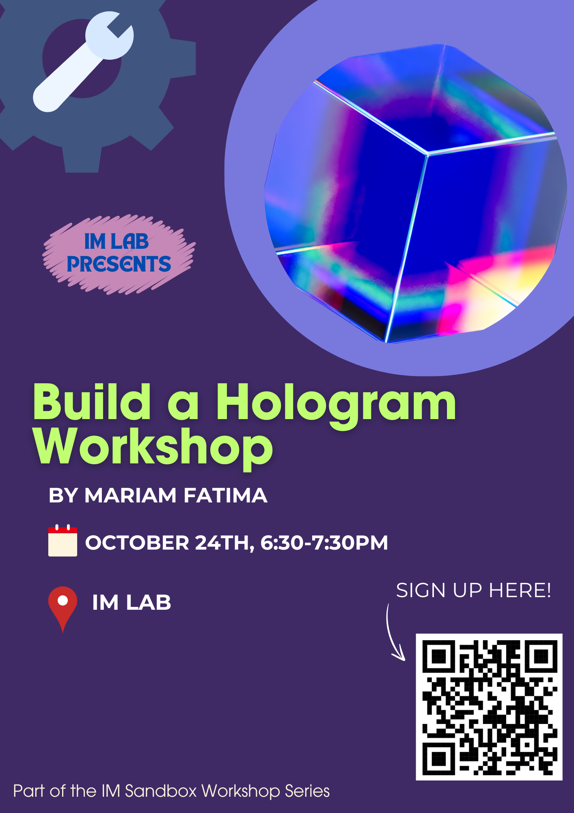

Shortcut to [today's assignment](homework.md#todays-assignment)  
Shortcut to [today's lecture](lectureNotes.md#todays-lecture)  
[Presentation
schedule](https://docs.google.com/spreadsheets/d/1s8S0qX6co3bIBSuFY7zDSmBrV4rCpc_IT61iG6xhgfM/edit?gid=0#gid=0)  
[Play
script](https://docs.google.com/document/d/14n8aM1Zh9eJmkvJriH-87WQnF9FcQNhilrOcNERecpM/edit)  

## New York University Abu Dhabi  
## Interactive Media Program
## Course title: Performing Robots
Course number: IM-UH 2117  

Credit Hours: 4     

Prerequisites: None     

Session: Fall 2024       

Course website:
[https://github.com/michaelshiloh/PerformingRobots](https://github.com/michaelshiloh/PerformingRobots)  

Instructor: Michael Shiloh mshiloh@nyu.edu   
Support staff: Stefania Avramidi sa8410@nyu.edu

Office hours: Schedule an appointment [here](https://calendly.com/michaelshiloh/office_hours)

Meeting times:    
- 2:10-3:25 Tuesday
- 2:10-4:50 Thursday

Class location: C3-029 (IM Lab)

This is subject to change

This document: Lecture Notes

### Tuesday August 27

#### Administration

#### In-class activity

Download and install Arduino from [here](https://www.arduino.cc/en/software)

#### What is this class about
- What are robots?
- What is performance?

Introduction

- Watch some videos
	- [Welcome to Duloc](https://www.youtube.com/watch?v=X81AoBcVnaA)
	- [Survival Research Labs](https://youtu.be/aZwkvM4BzN4?t=302)
	- [Bot and Dolly](https://youtu.be/lX6JcybgDFo?t=132)
	- [Oriza Hirata](https://youtu.be/CWnnqObk1qM)
	- [Robotic Church](https://vimeo.com/114296519#t=120s)
    - [Last
      year](https://drive.google.com/file/d/1WoT0_J1sPGSjmjJODrpIFxpetJMYGRMR/view?usp=sharing)

- What is this class about?
- [weekly schedule](weeklySchedule.md)
- [Syllabus](syllabus.md)

- Who are we?
- Who are you?
	- Have you used Arduino before?
    - What experience do you have with construction?
    - What experience do you have with hand and power tools?

Homework
- Github
- Discord

### Thursday August 29
#### Today
- Very quick review of Arduino
- Very quick review of switch on solderless breadboard
- L298 Motor Driver with external battery and large motor

#### Lecture

##### Very quick review of Arduino

##### Very quick review of switch and LED on solderless breadboard
- Use built-in pullup resistor for switch. This means switch pulls `HIGH`.

##### L298 Motor Driver with external battery and large motor

To control a large motor, 
we need an intermediate device called a motor driver. Our
particular motor driver is based on the L298. To find out how we use it, we
simply Google "L298 Arduino".
[Here](https://howtomechatronics.com/tutorials/arduino/arduino-dc-motor-control-tutorial-l298n-pwm-h-bridge/)
is the first thing that showed up for me. The point here is that many of the
components we use are quite generic and there is a lot of information on using
components with Arduino, but we can not follow the instructions blindly. We do need to understand how it works.

Sample code, assuming you used these pins: 
```
void setup() {
  // Pins 2 and 3 are connected to In1 and In2 respectively
  // of the L298 motor driver
  pinMode(2, OUTPUT);
  pinMode(3, OUTPUT);
}

void loop() {
  // make the motor turn in one direction
  digitalWrite(2, LOW);
  digitalWrite(3, HIGH);
  delay(5000); // let it turn for 5 seconds

  // now reverse direction
  digitalWrite(2, HIGH);
  digitalWrite(3, LOW);
  delay(5000);
}
```

### Tuesday September 3
#### Today
- Shields
- Soldering
#### Lecture

##### Shields
- Ready made shields
    - Music Maker Shield
- Prototyping shields
    - No solderless breadboard!
    - What can go wrong?
- Custom shields
    - Servo shield
- Other PCBs

##### Soldering demonstration 
- Wires to boards
    - What can go wrong?
- Music Maker Shield pins
    - What can go wrong?
- NeoPixel Pins
    - What can go wrong?
- Fixing problems

### Thursday September 5
#### Today
- Music Maker Shield
- NeoPixels

##### Music Maker Shield
- [Adafruit Music Maker Shield](https://learn.adafruit.com/adafruit-music-maker-shield-vs1053-mp3-wav-wave-ogg-vorbis-player?view=all)

##### NeoPixels
- [Neopixels](https://learn.adafruit.com/adafruit-neopixel-uberguide/the-magic-of-neopixels)


### Tuesday September 10
#### Today
- Homework
- Performance

### Thursday September 12
#### Today
- Results of vote!
- Presentation schedule!
- Robot Base!

##### Results of vote!
* Which play are we doing?
* Homework for next week: 

1. Choose a partner and a character that you and your partner would like to
   work on
1. Collaborate with entire class (use Discord or create any group you wish)
    to create outline of play collaboratively

##### Presentation schedule!
[here](https://docs.google.com/spreadsheets/d/1s8S0qX6co3bIBSuFY7zDSmBrV4rCpc_IT61iG6xhgfM/edit?gid=0#gid=0)

##### Robot Base

- Motors
- Arduino
- L298 Motor Driver 
- External battery 

How does it drive?

- Wheels 
- Tires
- Hubs
- Steering

How do we build it?

- Wooden base
- Where should the wheels go?
- How does it keep from tipping over?

Construction techniques

- Motor mounting brackets
- Screws vs. Nuts and Bolts
- Working with wood
- Wire management
- Holding down the circuits (Arduino, L298)
- Holding down the battery

### Tuesday September 17
#### Today
- Announcements
- Presentations
- Design workshop

##### Announcements
- Student-lead workshops
    - certificate
- IM Program Gathering
    - Thursday right after class

##### Presentations

[Presentation
schedule](https://docs.google.com/spreadsheets/d/1s8S0qX6co3bIBSuFY7zDSmBrV4rCpc_IT61iG6xhgfM/edit?gid=0#gid=0)

##### Designing Robots
Stefania gave a wonderful presentation on [Designing
Robots](https://docs.google.com/presentation/d/1L1_uAU-QNXxY9JEUMLb3Z23RMs5x94aMDoCwe21gwoY/edit#slide=id.p)

### Thursday September 19
#### Today
- Build robots!

Parts needed
- Wooden base (about 55cm x 65 cm)
- Motors (2x)
- Hub (2x)
- Motor bracket (2x)
- M4x8 bolts to attach motors to motor brackets (8x)
- M4x10 bolts to attach hub to shaft (4x)
- Acrylic wheels (2x)
- Rubber tires (2x)
- Casters (2x)


In addition, you will need to extend the wires on the motors, 
and drill a hole in the wooden base for the wires to come through

### Tuesday September 24
#### Today
- How to do research
- Presentations

##### How to do research
- Why the delay?
- What I want
- Presentation by Grace Adeneye, Research Librarian for the Arts. Grace has an
  educational background in English literature and Museum and Gallery
  Practice. Grace also serves the first year student community, and is a
  published author.

##### Presentations

- What is the significance of this work? What have others said or written about this project?
- Does the use of robots make the project better? Does it affect us differently? How or how not?
- Why are we so fascinated by robots? How does this fascination affect this project? (this relates to the question above)
- What does the project, and the fact of using robots, say about the Human Condition?

### Thursday September 26
#### Today
- Finish robot bases

### Tuesday October 1

I am sick and won't be coming to campus. Please continue with your
presentations. I want everyone to write down at least one question
that comes out of each presentation today. Write the question in your journal
with today's date.

### Tuesday October 8
#### Today
- Presentations: Luke and Vahagn

### Thursday October 10
#### Today
- Presentations: Aaron and Mbebo
- Hobby RC and Motor Controller Shield

##### Hobby RC and Motor Controller Shield
1. Solder pins according to board [video](https://youtu.be/TmrvE1iV0zE)
movie
    - Skip the receiver for now
2. Connect the L298 Breakout Board to the Hobby RC and Motor Controller shield
following the table below:

| L298 Pin | Arduino Pin | Wire Color |
| --- | --- | ----- |
| EN1 | 9 | Yellow |
| IN1 | 8 | Blue |
| IN2 | 7 | Blue |
| IN3 | 10 | Green |
| IN4 | 12 | Green |
| EN2 | 11 | White |
| GND | GND | Black |

Videos:
- [Soldering header socket to L298 Breakout Board](https://youtu.be/Eat3gU4fdVc)
- Soldering wires between L298 Breakout Board and Hobby RC and Motor Controller Shield,
  [part 1](https://youtu.be/473tP4C34UU) and [part
  2](https://youtu.be/3yuinKMAYRI)

### Tuesday October 22
#### Today
- Presentations: Aaron and Hind A
- IM workshop
- Homework: 1) who, why, and how about the murder and 2) finish the robot base
- Next steps: Design your robot!

##### IM workshop

The first workshop in the IM lab Workshop Series is this Thursday!



##### Next steps: Design your robot!
- Identify components
- Block diagram
- Mechanical details

### Thursday October 24
#### Today
- Presentations: Linh and Luke
- Finishing the bases: Power 
- Building the robot

##### Finishing the bases: Power 
- Coaxial connector for the 12V for the motor
- Coaxial connector for 9V for the Arduino

##### Building the robot
- Review your designs
- servo motors for arms, hair

### Tuesday October 29
#### Today
- Presentations: Javeria, Ahsen
- State of your robot
- What will you complete for Thursday
- Calendar: oct 31, Nov 5, 12, 19, 26, Dec 3, 5
    - Weekends
- Homework

### Thursday October 31
#### Today
- Presentations: Sara, Toomie
- nRF Servo Mega shield
- Socket for radio for controlling the robot base
- Building with cardboard
- Attaching things to a servo motor


##### nRF Servo Mega shield

nRF Servo Mega Shield [video](https://youtu.be/EMkqwKK7xOQ)

steps

1. Install the .1 uFD capacitor in position C1. This is the tiny brown disk
   that says "104" on it. This component is NOT polarized. Solder.
   Cut the excess leads right down to the solder. Discard the cut of portion
   so that it doesn't cause a short circuit
2. Cut two pieces of header sockets each with 4 positions. They need to be
   held together so use a piece of header pins across them to hold them
   together. Solder one pin, and then reheat the pin while you straighten out
   the connector. Solder the rest of the pins.
1. Prepare 6 sets of header pins, each with 3 positions. Insert into positions
   M1 - M6 and D20 (my mistake in labeling). Solder one pin, straighten, and
   then solder the rest of the pins. You may find it easier to do one header
   at a time instead of trying to do all 6 at once like I did.
1. From the bag of feed-through headers, remove six 5 position headers and one
   10 position header. Return the rest to the bag.
    Solder one pin, straighten, then solder the rest. It is very important to
    get these to line up properly so don't solder the rest of the pins until
    the header is straight.
1. Install the feed through header that is two rows of 3 pins. **Note that
   this goes in the opposite direction i.e. the pins face up and the socket
   faces down**. Solder and straighten.
1. Install the two 470 uFD electrolytic capacitors. 
    Note that these components **are polarized** so you have to install them in
    the right direction. The grey stripe must go into the hole with the white
    semicircle.
   Cut the excess leads right down to the solder. Discard the cut of portion
   so that it doesn't cause a short circuit
1. Install the screw terminal. Make sure that the openings face the edge of
   the board. Solder. These pins are quite thick and the hole is quite big, so
   keep feeding solder until the hole fills up.
1. You are done! Yay! Take a picture for your journal.

##### Socket for radio for controlling the robot base

- Add sockets for the RadioLink receiver (starts at minute 10 in
    [this](https://www.youtube.com/watch?v=TmrvE1iV0zE) video)

##### Building with cardboard
- strength

##### Attaching things to a servo motor
- attaching motors
- attaching to motors

### Tuesday October 29
#### Today
- Presentations: Ahsen, Avinash
- Check homework

### Thursday November 7
#### Today
- Controlling the robot base
- Understanding the giant servo

##### Controlling the robot base
- Radio system
	- **put your name on all items received!!!!!!!!!!!!!!!!!!!!!!!!**
- Pairing
	- Follow the instructions in "How to bind receiver to transmitter" in 
    the [RC4GS
    manual](https://github.com/michaelshiloh/resourcesForClasses/blob/master/src/arduinoSketches/hobbyRC/RC4GSManual.pdf)
- Code
	- Follow for example Linh Tran's
      [code](https://github.com/LinhTran263/performingrobots/blob/main/radio.ino). Note the pin assignments in the tables below:

| L298 Pin | Arduino Pin | Wire Color |
| --- | --- | ----- |
| EN1 | 9 | Yellow |
| IN1 | 8 | Blue |
| IN2 | 7 | Blue |
| IN3 | 10 | Green |
| IN4 | 12 | Green |
| EN2 | 11 | White |
| GND | GND | Black |


| Receiver Channel | Arduino Pin | 
| --- | --- | 
| CH 1 | 6 | 
| CH 2 | 5 |
| CH 3 | 4 | 
| CH 4 | 3 | 
| CH 5 | 2 | 

- Adjusting min and max speed

##### Understanding the giant servo

Before doing anything else make sure the jumpers are configured correctly.
Those are the set of yellow pins at the bottom of the picture, with the blue and
red jumpers.  The colors don't matter, but the positions must be exactly as
shown below:


If you want to know what the different configurations are this is the best
documentation I could find from the Amazon product pages:
<pre>


</pre>

<pre>


</pre>

<pre>


</pre>


After the jumpers are configured correctly you need to connect 12 V power to
the servo motor using the green screw terminals in the upper left corner of
the picture below. **Make sure you get the polarity correct or you will damage
the motor!** Double check the wires before you turn on the power supply

Once you have done the above two steps you can connect the servo control cable
(that's the black, red, and white cable that looks like the servo cables you
are familiar with) to your Arduino.

Once attached you can control the giant servo motor as you would any servo
motor in Arduino.

### Tuesday November 12
#### Today
- Delay presentations to Thursday
- nRF radio system

##### nRF radio system

###### Receiver
https://github.com/michaelshiloh/resourcesForClasses/blob/master/kicad/nRF_servo_Mega/documentation/nRF_servo_Mega_schematic.pdf

###### Transmitter
https://github.com/michaelshiloh/resourcesForClasses/blob/master/kicad/Arduino_Shield_RC_Controller_v2/documentation/Arduino_Shield_RC_Controller_v2_schematic.pdf

- Add potentiometer
- Add LCD

###### Code
https://github.com/michaelshiloh/resourcesForClasses/tree/master/src/arduinoSketches/nRF24L01/rf24PerformingRobotsTemplate_2024

### Thursday November 14
#### Today
- Play walk-through
- Robot status
- Presentations
- Avinash makeup

#### todays-lecture
### Tuesday November 19
#### Today
- Demo remote control of servo motor and/or NeoPixel
- Play walk-through
- More batteries
- Error reporting
