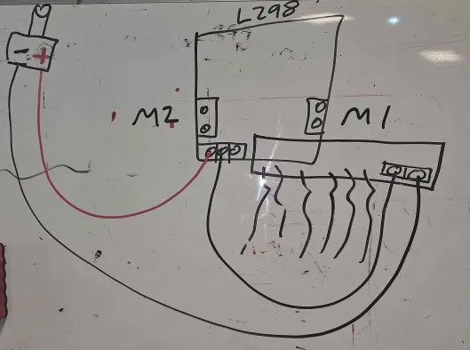
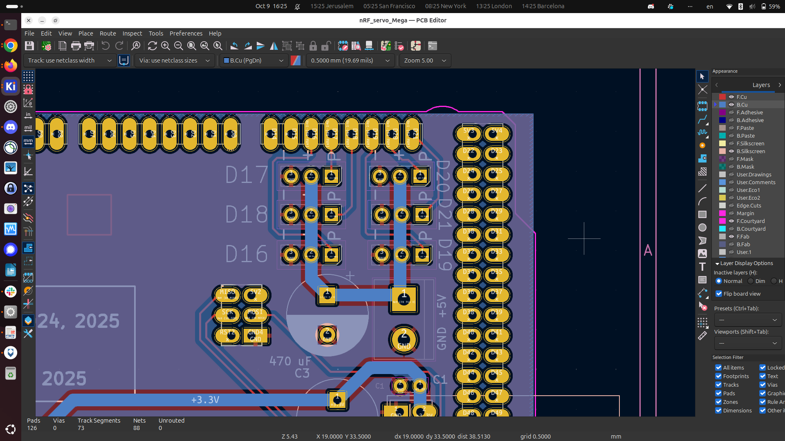

Shortcut to [today's assignment](homework.md#todays-assignment)  
Shortcut to [today's lecture](lectureNotes.md#todays-lecture)  
Shortcut to [play
script](https://docs.google.com/document/d/1j0KADb83ufT4OnbhTfyRpN-7AbmNvH17S0KhKeWV_Zc/edit?tab=t.0)  
Shortcut to [research presentations](https://docs.google.com/spreadsheets/d/1H67fPcgNpJAw_h9IF7Uh4UINfpykP3S3smrm_njblvk/edit?usp=sharing)

#### New York University Abu Dhabi  
#### Interactive Media Program

* Course Information
    * Course Code and Number: IM-UH 3117  
    * Course Title: Performing Robots
    * Credit Hours: 4     
    * This is a 14 week course consisting of fourteen 75 minute meetings and
      fourteen 150 minute meetings
    * Instructional time requirements are met by the scheduled meeting times
    * Class location: C3-029 (IM Lab in the Art Center)
    * Prerequisites: IM-UH 1010 or INTM-SHU 101 Interaction Lab or IMNY-UT 101 Creative Computing or DM-UY 1133 Creative Coding
* This course counts toward the following NYUAD degree requirements:
    * Majors > Interactive Media
    * Majors > Interactive Media > Physical Computing 
    * Minors > Interactive Media
* Faculty Details
    * Professor: Michael Shiloh mshiloh@nyu.edu   
    * Office hours: Schedule an appointment [here](https://calendly.com/michaelshiloh/office_hours)
    * Office phone number: 02-628-5185
    * Office location: C3-156

* Session: Fall 2025       
* Meeting times:    
	- 3:20-4:35 Tuesday
	- 3:20-6:00 Thursday

* Course website: [https://github.com/michaelshiloh/PerformingRobots](https://github.com/michaelshiloh/PerformingRobots)  

This document: Lecture Notes

### Tuesday August 26 Week 1

#### Administration
- I'll be gone next week!
- Apply to be a [Lab Assistant](https://app.joinhandshake.com/emp/jobs/10154995)

#### In-class activity

Download and install Arduino from [here](https://www.arduino.cc/en/software)

#### What is this class about
- What are robots?
- What is performance?

Introduction

- Watch some videos
	- [Welcome to Duloc](https://www.youtube.com/watch?v=X81AoBcVnaA)
	- [Survival Research Labs](https://youtu.be/aZwkvM4BzN4?t=302)
	- [Bot and Dolly](https://youtu.be/lX6JcybgDFo?t=132)
	- [Oriza Hirata](https://youtu.be/CWnnqObk1qM)
	- [Robotic Church](https://vimeo.com/114296519#t=120s)
    - [This class in 2023](https://drive.google.com/file/d/1WoT0_J1sPGSjmjJODrpIFxpetJMYGRMR/view?usp=sharing)

- What is this class about?
- [weekly schedule](weeklySchedule.md)
- [Syllabus](syllabus.md)

**Be prepared to work hard in this class!**

- If you have never built mechanisms, then the model that you have in your
  head of how something should work will likely be very wrong. As a result,
  what worked perfectly in your head in theory will be very likely to fail in
  practice.
- Expect to rebuild the same thing many times until it works. 
- Even after you get things working, expect them to break as your robot moves
  around
- Expect that your estimates of how long something should take to be very
  wrong
- A robot is a complex system consisting of many different sub-systems.
  While each sub-system might work perfectly by themselves, when they are
  integrated into a single system unexpected interactions may (will) cause
  unexpected problems.

- Introductions
	- What is your creative passion?
	- What is your experience with theater?
	- Have you built robots before?
    - What experience do you have with construction and mechatronics?
    - What experience do you have with hand and power tools?

Homework
- See shortcut above

### Thursday August 28
- Arduino, solderless breadboard, switch
- L298 Motor Driver with external battery and large motor

#### Administration
- I'll be gone next week!
- Apply to be a [Lab Assistant](https://app.joinhandshake.com/emp/jobs/10154995)
- One seat open in Communications Lab


#### Very quick review of Arduino

#### Very quick review of switch and LED on solderless breadboard
- Use built-in pullup resistor for switch. This means switch pulls `HIGH`.

#### L298 Motor Driver with external battery and large motor

To control a large motor, 
we need an intermediate device called a motor driver. Our
particular motor driver is based on the L298. To find out how we use it, we
simply Google "L298 Arduino".
[Here](https://howtomechatronics.com/tutorials/arduino/arduino-dc-motor-control-tutorial-l298n-pwm-h-bridge/)
is the first thing that showed up for me. The point here is that many of the
components we use are quite generic and there is a lot of information on using
components with Arduino, but we can not follow the instructions blindly. We do
need to understand how it works.

**Warning** there is an error in the schematic under *Arduino and L298N Motor
Driver*. Can you spot the problem? Hint: Look at the schematic under *Arduino
Robot Car Control using L298N Motor Driver* and see if you can find the added
connection that was missing.

##### Code
Before you look at the code here, think about the circuit.
- `EN` needs to be `HIGH` in order to turn on the motor driver
- IN1 and IN2 need to be opposite (if one is `HIGH` then the other should be
  `LOW`) in order to make the motor turn
- Can you think of how to do this? (Hint: you can do this with 4 lines of code
  in `setup()` function and an empty `loop()` function)


Sample code, assuming you used these pins: 
```
void setup() {
  // Pins 2 and 3 are connected to In1 and In2 respectively
  // of the L298 motor driver
  pinMode(2, OUTPUT);
  pinMode(3, OUTPUT);
}

void loop() {
  // make the motor turn in one direction
  digitalWrite(2, LOW);
  digitalWrite(3, HIGH);
  delay(5000); // let it turn for 5 seconds

  // now reverse direction
  digitalWrite(2, HIGH);
  digitalWrite(3, LOW);
  delay(5000);
}
```

### Thursday September 11
- Play theme and cast
- Hobby RC concepts

### Tuesday September 16
Play feedback

### Thursday September 18
- Soldering
- IM Lab policies
- Robot base: add H-bridge, Arduino

#### Soldering
- Wire to wire (stranded-stranded)

#### Robot base: add H-bridge, Arduino
- Mounting the Arduino
- Mounting the H-bridge
- Mounting the battery

### Tuesday September 23
- University Take Over the Museum
- Homework
- Soldering
- L298 interface board and Arduino shield
- Robot base
- Remote control

##### University Take Over the Museum
Information sessions:
- Tuesday - 23.09.2025 at 13:00
- Friday - 26.09.2025 at 11:00
  [link](https://teams.microsoft.com/v2/?meetingjoin=true#/l/meetup-join/19:meeting_ZDRkMjE5ZTktN2RmYi00ODNmLWE4NDAtZGM5ZWI5NGJiZWQw@thread.v2/0?context=%7b%22Tid%22%3a%2241216e3e-9c43-43e7-ab8f-f80f21828b9f%22%2c%22Oid%22%3a%223024d057-210a-4d30-be5c-8f160582b2bc%22%7d&anon=true&deeplinkId=7c4d7155-0f8d-4563-a1e6-074866249076)

###### Homework
- [Play](https://docs.google.com/document/d/1j0KADb83ufT4OnbhTfyRpN-7AbmNvH17S0KhKeWV_Zc/edit?tab=t.0) outline
- [Research presentations](https://docs.google.com/spreadsheets/d/1H67fPcgNpJAw_h9IF7Uh4UINfpykP3S3smrm_njblvk/edit?usp=sharing)

##### Soldering
- Heat shrink tubing
- Wire to board (stranded)
- Pins and headers sockets

##### L298 Breakout Board to the Hobby RC and Motor Controller shield
- Wire mapping
- Header pins and sockets must be on the correct side
- Header pins must be straight
- Excellent soldering
- No short circuits

###### Videos

- [Solder pins according to board](https://youtu.be/TmrvE1iV0zE)
- [Soldering header socket to L298 Breakout Board](https://youtu.be/Eat3gU4fdVc)
- Soldering wires between L298 Breakout Board and Hobby RC and Motor Controller Shield,
  [part 1](https://youtu.be/473tP4C34UU) and [part
  2](https://youtu.be/3yuinKMAYRI)

###### Headers and wires between L298 Breakout Board and Hobby RC and Motor Controller Shield

Watch the above videos so you know what you are doing

**Above all, make sure you are putting the correct components on the correct side
of the board. If you have any doubts, post pictures and questions on Discord**

Solder all the headers on the PCB labeled "Arduino Shield Hobby RC and Motor Control"

1. Insert three of the 2x3 header sockets into your RC receiver. Make sure
   they are all pressed down so that they are at the same height.
2. Insert the header sockets (with the RC receiver) into the PCB. Make sure it
   is on the top side.
2. Solder the 18 pins of the 2x3 header sockets into place.
3. Once the 2x3 header sockets are soldered in place, you can gently unplug
   the RC receiver and put it aside while you work on the rest of the board
4. Install the 4 Arduino feed through headers. You will need 1x with 6 pins,
   1x with 10 pins, and 2x with 8 pins. Make sure that they are all the same
   height.
1. **make sure all feed through headers are of the same height!**
1. **make sure the feed through headers are on the correct side of the
   board!**
5. Solder **only one pin** of each feed through header, and then reheat the
   solder (melt the solder) so that you can reposition the header. Make sure
   that it is pushed flush against the board, and that it is straight. Repeat
   for each feed through header.
6. Once all feed through headers are flush and straight, proceed to solder the
   rest of the pins

Solder the header and the screw terminal on the PCB labeled "L298 Interface"

1. Insert the two position screw terminal on the top of the PCB
1. Make sure that the opening of the screw terminal is facing the right way.
   Look at the example if you are unsure.
1. Solder **only one pin** of the screw terminal, and then reheat the
   solder (melt the solder) so that you can reposition the screw terminal. Make sure
   that it is pushed flush against the board, and that it is straight. 
1. Solder the other pin of the screw terminal
1. Prepare a strip of header socket with 6 positions. Trim the rough edge as
   necessary so that it will fit onto your L298 H-bridge.
1. Insert the 6 position header socket on the **bottom** of the PCB
1. Solder **only one pin** of the header socket, and then reheat the
   solder (melt the solder) so that you can reposition the header. Make sure
   that it is pushed flush against the board, and that it is straight. 

Solder the wires between the "Arduino Shield Hobby RC and Motor Control"
and the "L298 Interface" PCB.

1. Make the wires at least 20cm longer than you need. You will probably need
   to move things around. 
2. Use a black wire for ground, and any other color (except for red and black)
   for the other connections. Use different colors to make it easier for you
   to keep track of things.


| L298 Pin | Arduino Pin | Wire Color |
| --- | --- | ----- |
| EN1 | 9 | Yellow |
| IN1 | 8 | Blue |
| IN2 | 7 | Blue |
| IN3 | 10 | Green |
| IN4 | 12 | Green |
| EN2 | 11 | White |
| GND | GND | Black |

Finally, you can carefully plug the "Arduino Shield Hobby RC and Motor Control" shield
on top of your Arduino, and carefully plug the "L298 Interface" board to your
L298 H-bridge. This will make all connections except for two grounds: you will
need one ground to the L298 H-bridge, and the other ground to the battery. 

### Thursday September 25
- [Research presentations](https://docs.google.com/spreadsheets/d/1H67fPcgNpJAw_h9IF7Uh4UINfpykP3S3smrm_njblvk/edit?usp=sharing)
- Finish robot base
- Add remote control

###### Robot base power
To provide power to the L298 H-bridge, you will need to wire the coax
connector slightly differently than we did in week 1. 
- The red wire from the corner of the L298 goes to the **+** terminal of the
  coax connector
- the **-** end of the coax connector goes to the **GND** connector on the
  L298 Interface PCB. 
- Another black wire goes from the **GND** connector on the L298 Interface PCB
  to the middle of the three screw terminals on the L298 H-bridge:
  

##### Hobby RC testing
- Plug in the RC receiver. Make sure it's the right way. Pay attention to the
  labels on the PCB and the tiny diagram on the RC receiver. It is in a small
  red box and has a **+**, **-**, and a symbol that looks like a square wave.
  The **+** corresponds to **5V**, the **-** corrensponds to **GND**, and the
  square wave corresponds to **SIG**
- Read the section on pairing in the RC4GS [user
  manual](https://www.radiolink.com.cn/rc4gs_manual)
- Test using
  [code](https://github.com/michaelshiloh/resourcesForClasses/blob/master/src/arduinoSketches/hobbyRC/minimalMoreChannels/minimalMoreChannels.ino)

##### Remote control of your robot
You will need to combine and modify the code that we used to test the motors
in week 1, along with the code above for testing the RC system.

**Important**
We used different pin numbers for the motor control, so you will need
something like:

```
const int LEFT_MOTOR_EN = 9;
const int LEFT_MOTOR_INA= 8;
const int LEFT_MOTOR_INB= 7;

const int RIGHT_MOTOR_EN = 11;
const int RIGHT_MOTOR_IN1= 10;
const int RIGHT_MOTOR_IN2= 12;

void setup() {

  pinMode(LEFT_MOTOR_EN , OUTPUT);
  // do all pins

  // set initial speed
  analogWrite(RIGHT_MOTOR_EN, 180);  
  // do other motor
}

// don't just copy this blindly; understand what I'm doing and
// adapt to your needs
void loop() {
  rc_read_values();
  if (rc_values[RC_CH4] > 1450 && rc_values[RC_CH4] << 1550) {
    stop();
  } else if (rc_values[RC_CH2] << 1450) {
    forward)();
  }

  void stop() {
    stopLeftMotor();
    stopRightMotor();
  }

void stopLeftMotor(){
    digitalWrite(LEFT_MOTOR_INA, LOW);
    digitalWrite(LEFT_MOTOR_INB, LOW);
    // or turn the speed to zero
}

  void forward() {
    leftMotorForward();
    rightMotorForward();
}

void leftMotorForward() {
    digitalWrite(LEFT_MOTOR_INA, LOW);
    digitalWrite(LEFT_MOTOR_INB, HIGH);
  }

void leftMotorForwardWithSpeed(int speed) {
    analogWrite(LEFT_MOTOR_EN, speed);
    digitalWrite(LEFT_MOTOR_INA, LOW);
    digitalWrite(LEFT_MOTOR_INB, HIGH);
  }
}

//etc.
```


### Tuesday September 30
- Bases done
- Bodies

#### Fabrication
- Considerations
    - Repair and modifications
    - Wires
        - Routing
        - Strain relief
        - Color coding
        - Labeling
        - **No jumper wires**
        - Alternatives to soldering
        - Strain relief (again)
        - Zip ties
    - Clothing
- Wood construction
    - Body
    - Frame
- Cardboard construction
    - Strength
        - Braces
        - Double
        - Cross ply
        - Wood
    - Shapes
        - Cubes
        - Cylinders

### Thursday October 2
- Missing homework
- Why are assignments not all listed in the syllabus?
- Adding motion and lights to your robot

#### Motion
- "Standard" servo motors (5V)
    - Brackets
- "Giant" servo motors (12V)
    - L brackets
- Supporting large objects (heads, bodies)

### Tuesday October 7
- Missing homework
- Adding servo motors to your robot body
- Neopixels

#### Adding servo motors to your robot body
- Brackets
- Hardware
- Servo extensions
- Second Arduino
- Second (or third) battery

#### Neopixels (**5V only or they will all be destroyed**)
- Strain relief
- Soldering

### Thursday October 2
- Midterm evaluation
- Discord
- Controlling and powering your servo motor

#### Midterm evaluation
- For any technical assistance, problems, guidance, or for parts or tools, use
  the class channel on Discord. I will not answer technical questions via
  email or direct messages.

#### Controlling and powering your servo motor
Your homework assignment that is due today
is that each team should have one servo motor attached to the body of their robot.
Today we will learn how to control and power it

1. A new Arduino board: The [Arduino Mega
2560](https://docs.arduino.cc/hardware/mega-2560/)
1. Mounting your Arduino Mega
    1. Bracket
    1. Where to put it
1. Power for the Arduino Mega
    1. Why not use the Arduino power bank?
    1. Another powerbank
1. Power for your servo motors
1. 5V power for "hobby" servo motors
1. 12V power for giant servo motors
    1. How to provide 12V to more than one motor?
1. How to conveniently control servos from Arduino Mega, yet power from
separate supply?

1. [How to use the giant servo
   motor](https://github.com/michaelshiloh/resourcesForClasses?tab=readme-ov-file#giant-servo-motors-resources)


### Tuesday October 21
- Midterm evaluation
    - Journal
- Class meets on Zoom (link in Brightspace)
- Group presentations: 
    - Clara and Mariam	
    - Sudiksha and Ghadir	
    - Aysha And Hari

### Thursday October 23
- Lead a workshop!
- Journal
- Presentations for next week
- Homework: status, what for next week

#### Lead a workshop!


#### Journal
- Example
- Resize images using the last suggestion in [Github
  Resources](https://github.com/michaelshiloh/resourcesForClasses?tab=readme-ov-file#github-resources)

### Tuesday October 28
- Debugging
- Plan for next six weeks
- Presentations

#### Debugging
Suggestions
[here](https://github.com/michaelshiloh/resourcesForClasses?tab=readme-ov-file#debugging)


#### Plan for next six weeks
- Oct 28, 30; Nov 4, 6; 11, 13; 18, 20; 25, 27; Dec 2, 4; 
- Finish play
- Rehearsals
- What remains for your robot
    - Identify remaining features (due Thursday)
    - Implement remaining features
    - Remote control for features
    - Sound clips
    - Programming

##### todays-lecture
### Thursday October 31
- Remote Control via nRF remote control system

##### nRF radio system

###### Receiver
https://github.com/michaelshiloh/resourcesForClasses/blob/master/kicad/nRF_servo_Mega/documentation/nRF_servo_Mega_schematic.pdf

###### Transmitter
https://github.com/michaelshiloh/resourcesForClasses/blob/master/kicad/Arduino_Shield_RC_Controller_v2/documentation/Arduino_Shield_RC_Controller_v2_schematic.pdf

###### Code
https://github.com/michaelshiloh/resourcesForClasses/tree/master/src/arduinoSketches/nRF24L01/rf24PerformingRobotsTemplate_2024


### Tuesday November 4
- Who did homework
- Read through play
