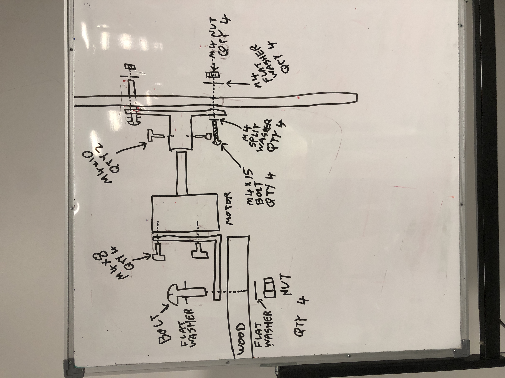

Shortcut to [today's assignment](homework.md#todays-assignment)  
Shortcut to [today's lecture](lectureNotes.md#todays-lecture)  
[Presentation
schedule](https://docs.google.com/spreadsheets/d/1s8S0qX6co3bIBSuFY7zDSmBrV4rCpc_IT61iG6xhgfM/edit?gid=0#gid=0)  
[Play
script](https://docs.google.com/document/d/14n8aM1Zh9eJmkvJriH-87WQnF9FcQNhilrOcNERecpM/edit)  

## New York University Abu Dhabi  
## Interactive Media Program
## Course title: Performing Robots
Course number: IM-UH 2117  

Credit Hours: 4     

Prerequisites: None     

Session: Fall 2024       

Course website:
[https://github.com/michaelshiloh/PerformingRobots](https://github.com/michaelshiloh/PerformingRobots)  

Instructor: Michael Shiloh mshiloh@nyu.edu   
Support staff: Stefania Avramidi sa8410@nyu.edu

Office hours: Schedule an appointment [here](https://calendly.com/michaelshiloh/office_hours)

Meeting times:    
- 2:10-3:25 Tuesday
- 2:10-4:50 Thursday

Class location: C3-029 (IM Lab)

This is subject to change

This document: Lecture Notes

### Tuesday August 27

#### Administration

#### In-class activity

Download and install Arduino from [here](https://www.arduino.cc/en/software)

#### What is this class about
- What are robots?
- What is performance?

Introduction

- Watch some videos
	- [Welcome to Duloc](https://www.youtube.com/watch?v=X81AoBcVnaA)
	- [Survival Research Labs](https://youtu.be/aZwkvM4BzN4?t=302)
	- [Bot and Dolly](https://youtu.be/lX6JcybgDFo?t=132)
	- [Oriza Hirata](https://youtu.be/CWnnqObk1qM)
	- [Robotic Church](https://vimeo.com/114296519#t=120s)
    - [Last
      year](https://drive.google.com/file/d/1WoT0_J1sPGSjmjJODrpIFxpetJMYGRMR/view?usp=sharing)

- What is this class about?
- [weekly schedule](weeklySchedule.md)
- [Syllabus](syllabus.md)

- Who are we?
- Who are you?
	- Have you used Arduino before?
    - What experience do you have with construction?
    - What experience do you have with hand and power tools?

Homework
- Github
- Discord

### Thursday August 29
#### Today
- Very quick review of Arduino
- Very quick review of switch on solderless breadboard
- L298 Motor Driver with external battery and large motor

#### Lecture

##### Very quick review of Arduino

##### Very quick review of switch and LED on solderless breadboard
- Use built-in pullup resistor for switch. This means switch pulls `HIGH`.

##### L298 Motor Driver with external battery and large motor

To control a large motor, 
we need an intermediate device called a motor driver. Our
particular motor driver is based on the L298. To find out how we use it, we
simply Google "L298 Arduino".
[Here](https://howtomechatronics.com/tutorials/arduino/arduino-dc-motor-control-tutorial-l298n-pwm-h-bridge/)
is the first thing that showed up for me. The point here is that many of the
components we use are quite generic and there is a lot of information on using
components with Arduino, but we can not follow the instructions blindly. We do need to understand how it works.

Sample code, assuming you used these pins: 
```
void setup() {
  // Pins 2 and 3 are connected to In1 and In2 respectively
  // of the L298 motor driver
  pinMode(2, OUTPUT);
  pinMode(3, OUTPUT);
}

void loop() {
  // make the motor turn in one direction
  digitalWrite(2, LOW);
  digitalWrite(3, HIGH);
  delay(5000); // let it turn for 5 seconds

  // now reverse direction
  digitalWrite(2, HIGH);
  digitalWrite(3, LOW);
  delay(5000);
}
```

### Tuesday September 3
#### Today
- Shields
- Soldering
#### Lecture

##### Shields
- Ready made shields
    - Music Maker Shield
- Prototyping shields
    - No solderless breadboard!
    - What can go wrong?
- Custom shields
    - Servo shield
- Other PCBs

##### Soldering demonstration 
- Wires to boards
    - What can go wrong?
- Music Maker Shield pins
    - What can go wrong?
- NeoPixel Pins
    - What can go wrong?
- Fixing problems

### Thursday September 5
#### Today
- Music Maker Shield
- NeoPixels

##### Music Maker Shield
- [Adafruit Music Maker Shield](https://learn.adafruit.com/adafruit-music-maker-shield-vs1053-mp3-wav-wave-ogg-vorbis-player?view=all)

##### NeoPixels
- [Neopixels](https://learn.adafruit.com/adafruit-neopixel-uberguide/the-magic-of-neopixels)


### Tuesday September 10
#### Today
- Homework
- Performance

### Thursday September 12
#### Today
- Results of vote!
- Presentation schedule!
- Robot Base!

##### Results of vote!
* Which play are we doing?
* Homework for next week: 

1. Choose a partner and a character that you and your partner would like to
   work on
1. Collaborate with entire class (use Discord or create any group you wish)
    to create outline of play collaboratively

##### Presentation schedule!
[here](https://docs.google.com/spreadsheets/d/1s8S0qX6co3bIBSuFY7zDSmBrV4rCpc_IT61iG6xhgfM/edit?gid=0#gid=0)

##### Robot Base

- Motors
- Arduino
- L298 Motor Driver 
- External battery 

How does it drive?

- Wheels 
- Tires
- Hubs
- Steering

How do we build it?

- Wooden base
- Where should the wheels go?
- How does it keep from tipping over?

Construction techniques

- Motor mounting brackets
- Screws vs. Nuts and Bolts
- Working with wood
- Wire management
- Holding down the circuits (Arduino, L298)
- Holding down the battery

### Tuesday September 17
#### Today
- Announcements
- Presentations
- Design workshop

##### Announcements
- Student-lead workshops
    - certificate
- IM Program Gathering
    - Thursday right after class

##### Presentations

[Presentation
schedule](https://docs.google.com/spreadsheets/d/1s8S0qX6co3bIBSuFY7zDSmBrV4rCpc_IT61iG6xhgfM/edit?gid=0#gid=0)

##### Designing Robots
Stefania gave a wonderful presentation on [Designing
Robots](https://docs.google.com/presentation/d/1L1_uAU-QNXxY9JEUMLb3Z23RMs5x94aMDoCwe21gwoY/edit#slide=id.p)

### Thursday September 19
#### Today
- Build robots!

Parts needed
- Wooden base (about 55cm x 65 cm)
- Motors (2x)
- Hub (2x)
- Motor bracket (2x)
- M4x8 bolts to attach motors to motor brackets (8x)
- M4x10 bolts to attach hub to shaft (4x)
- Acrylic wheels (2x)
- Rubber tires (2x)
- Casters (2x)



In addition, you will need to extend the wires on the motors, 
and drill a hole in the wooden base for the wires to come through

### Tuesday September 24
#### Today
- How to do research
- Presentations

##### How to do research
- Why the delay?
- What I want
- Presentation by Grace Adeneye, Research Librarian for the Arts. Grace has an
  educational background in English literature and Museum and Gallery
  Practice. Grace also serves the first year student community, and is a
  published author.

##### Presentations

- What is the significance of this work? What have others said or written about this project?
- Does the use of robots make the project better? Does it affect us differently? How or how not?
- Why are we so fascinated by robots? How does this fascination affect this project? (this relates to the question above)
- What does the project, and the fact of using robots, say about the Human Condition?

### Thursday September 26
#### Today
- Finish robot bases
- Build [Hobby RC and Motor Controller shield](https://youtu.be/TmrvE1iV0zE)
    - Skip the receiver for now
- Add L298, Arduino, and battery
- Make it go!

### Tuesday October 1

I am sick and won't be coming to campus. Please continue with your
presentations. I want everyone to write down at least one question
that comes out of each presentation today. Write the question in your journal
with today's date.

### Tuesday October 8
#### todays-lecture
#### Today
- Presentations: Luke and Vahagn
- Time permitting: Hobby RC and Motor Controller Shield

##### Hobby RC and Motor Controller Shield
1. Solder pins according to [this]() movie
2. Add wires that will go to the L298 board

| L298 | Arduino | Wire |
| Pin | Pin | Color |
| --- | --- | ----- |
| EN1 | 9 | Yellow |
| In1 | 8 | Blue |
