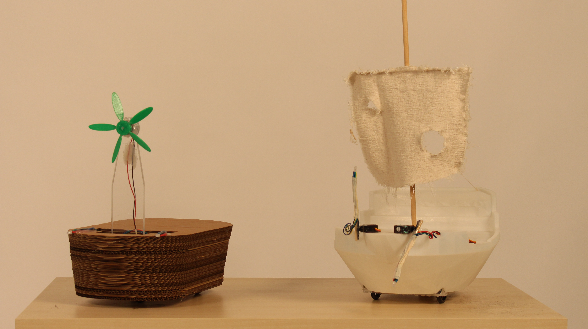

## New York University Abu Dhabi
## Interactive Media
# Performing Robots

### Course Number: IM-UH2117 
### Fall 2019  
### Tuesday: 1:15 - 3:55
### Thursday: 1:15 - 2:30

**Everything can be found on the course website:**
[https://github.com/michaelshiloh/PerformingRobots](https://github.com/michaelshiloh/PerformingRobots/)

## This page: Lectures

[Syllabus](syllabus.md)  
[Course Outline](README.md)  
[References, Bibliography, and Additional Information](references.md)  
[Student Github repositories](studentRepositories.md)  

#### Tuesday August 27 1:15 - 3:55

Introduction

- What is a robot?
- What is performance?
- Watch some videos
	- [Welcome to Duloc](https://www.youtube.com/watch?v=X81AoBcVnaA)
	- [Survival Research Labs](https://youtu.be/aZwkvM4BzN4?t=302)
	- [Bot and Dolly](https://youtu.be/lX6JcybgDFo?t=132)
	- [Oriza Hirata](https://youtu.be/CWnnqObk1qM)
	- [Robotic Church](https://vimeo.com/114296519#t=120s)

- What this class is about [Course Outline](schedule.md)
- Who am I?
- Syllabus
- Summary:
  -  Be present and participate in class
  -  No electronic distractions
  -  Be proactive: Communicate with me regarding difficulties, problems, illness, etc.
  -  Allow lots of time for homework as physical construction
  and debugging circuits and programs can be very time consuming.
- Announcements
  - Become a lab assistant!  Contact Ume (uh242@nyu.edu)
  - IM Lab Open House September 4 evening (with giant pizza!)
- Who are you?

Lecture
- 
- [Basic
	mechanisms](https://github.com/michaelshiloh/resourcesForClasses#mechatronic-resources)  
- Construction Techniques  
- Exercise   

**Assignment due August 29**
1. I strongly encourage that you make substantial progress on your cardboard
	 mechanism so that you can ask questions, and so that you can next work
	 on motorizing your project
1. Bring your laptop to class 
1. Read the syllabus

**Assignment due September 5**  

Build a cardboard device demonstrating at least two different basic mechanism.
Your device must be motorized and must run for 30 seconds without breaking

#### Thursday August 29 1:15 - 2:30

**Announcements**

- Clean up after yourselves! Includes but not limited to: 
	- Drill bits back in holder
	- Vacuum
	- Unplug hot glue guns
	- Put away my project if you move it
- Be a lab monitor! Job description and instructions for applying are
	[here](https://app.joinhandshake.com/jobs/3024058)  
- IM Lab Open House September 4 evening (with giant pizza!)  
- Please note the
[grading](https://github.com/michaelshiloh/PerformingRobots/blob/master/syllabus.md#grading) rubric in the syllabus  

**Motors!**

- Hand out motors, wheels, Arduino, USB cable
- Connect motors to Arduino, see how they turn
	- Reverse

Construction

- How to attach motors to project

1. Install Arduino from [here](https://www.arduino.cc/en/Main/Software).
	 Scroll down a little bit to the "Arduino IDE"". If you're on Windows, you
	 want the first item, the Windows Installer. 

1. Read the first three Arduino resources
[here](https://github.com/michaelshiloh/resourcesForClasses#basic-arduino-resources-from-arduino)

#### Tuesday September 3 1:15 - 3:55

**Activity: Arduino!**

- Verify installed properly (test with blink)
- Understand blink 
- Hand out wires, breadboard, LEDs, LDR, resistors
- Add an LED
- Add another LED  
- Digital inputs
- Analog output

Time permitting

- Analog input
- Digital output

#### Thursday September 5 1:15 - 2:30

**Show your fantastic machines!**

**Review**

- Arduino, breadboards, circuits, components, schematics
- Programming: analog/digital I/O 
- Loops
- Conditionals

**Lecture**

- DC motors
- Transistors

**Assignment due September 10**

1. Read the first five motor resources [here](https://github.com/michaelshiloh/resourcesForClasses#motors-resources). 
	You don't need to know this in depth, 
	just enough
	to know how the different types of motors behave.
1. Read the second transistor resource
	 [here](https://github.com/michaelshiloh/resourcesForClasses#transistor-resources).
	 Again, you don't need to know this in depth, just become familiar with the
	 concept of using a transistor as a switch.
1. Learn about the Adafruit motor shield by reading the sixth resource
	 [here](https://github.com/michaelshiloh/resourcesForClasses#motors-resources).
	 This will be important and we will review in class, but you will understand
	 it better if you try to understand the tutorial.
1. Create a github account (if you don't have one) and a repository for this
	 class by following the first resource
	 [here](https://github.com/michaelshiloh/resourcesForClasses#github-resources). Remember to name the
	 repository "performingRobots".

#### Tuesday September 10 1:15 - 3:55

We don't need computers for the first part of our lesson

**Homework**

- Who did the reading?
- Who made a github account and repository? Any problems? Any questions?
- I forgot to ask you to email me the URL to your repository. (Don't do this
	now).

**Review**

- Transistors to control high current loads (not only motors)
- How to reverse a motor
- Different types of motors
	- DC motors
	- Servo motors
		- DC motor + gears + position sensor + feedback circuit (servo loop)
	- Stepper motors
		- A whole lot of electromagnets arranged in a circle around a permanent
			magnet rotor

**Demo**
Soldering!
	- wires to each other
	- wires to scrap boards
	- pins to scrap boards
Pins!
	- Male
	- Female
	- Feed-through

**Assignment due September 12**

- Practice soldering
	- wires to each other
	- wires to scrap boards
	- pins to scrap boards
- When you are ready and comfortable
	- Solder **feed-through** headers to your motor shield

#### Tuesday September 10 1:15 - 3:55

**Activity: Adafruit Motor Shield V2**

DC motors
- Yellow plastic
- Using Arduino 5V
- Using separate power supply
	- Female DC coax to screw terminals
	- 12V 2A supply

Power supplies
- Voltage
- Current
- Visit the power supply buffet

Visit the motor buffet
- Servo motors
	- Wheels
- DC motors
- Stepper motors
- Motor hubs

Digital MultiMeter (DMM)
- Voltage
- Resistance
	- Only when circuit is **unpowered**
- Continuity

Servo motors 
- Basic usage

#### Thursday September 5 1:15 - 2:30

**Activity: Adafruit Motor Shield V2, continued**

Servo motors (continued)
- External power supply for servo motors (advanced topic)
	- **5-6V only!!!**
	- **Make sure polarity is correct**
	- **Make sure you cut the 5V trace where indicated**

Stepper motors

**Assignment due October 1**

1. Watch I, Worker and Sayonara by Oriza Hirata in
	 [this](https://drive.google.com/drive/folders/1P2xM8_1muDHbNeO_whHsqSpniy_LLpYq?usp=sharing)
	 Google Drive folder
2. Read [this](https://muse.jhu.edu/article/522851) article

#### Tuesday October 1 1:15 - 3:55

- Discuss movies and article
- Wired control panels
	- Using prototyping shields

#### Thursday October 3 1:15 - 2:30

**Assignment due Tuesday October 8**

You all have a lot to do. Please don't wait until Monday evening to start.
Most of you are new to this kind of work, and most likely the plan you have in
your head will not work. The big problem is that the model in your head is
unlikely to be how the physical reality really works, and you have to allow
time to build it once, see what doesn't work, make a change which might not
fix everything and in fact might introduce new problems, make another change,
etc. Anyone experienced will tell you that you this is an iterative process,
and it takes time. The only way to learn is by doing it.

If you run into problems, email me. I am more available this weekend than on
Sunday and Monday.

Max: Get the base tracking a line. Talk to me about batteries. Attach the
Arduino and breadboard to the base in a safe way that doesn't interfere with
the rest of the robot. You may make an enclosure but that's not necessary. I
prefer open enclosures for easy access.

Praggya: Make the face and the arms. I suggest you use a different Arduino
from Max's that will operate the base. You may also need separate batteries
for the servos. Make time to talk to me before Tuesday.  Attach the Arduino
and breadboard to the base in a safe way that doesn't interfere with the rest
of the robot. You may make an enclosure but that's not necessary. I prefer
open enclosures for easy access. Also get the Neopixel face working.

Paulin: Detect hands, send values to Arduino. Test with Praggya's hands to
actually make them move. Figure out where the Kinect will mount and how it
will get power. You might need to talk to me about batteries as well.

Maria: Get the arms controlled. Your team needs a body of some kind to which
everything will attach (I see you discussed arms, head, and base, but no
body). Attach the Arduino and breadboard to the body in a safe way that
doesn't interfere with the rest of the robot. You may make an enclosure but
that's not necessary. I prefer open enclosures for easy access. You can make
the body an open box (like I did) and use that as your enclosure for the
Arduino. You can use multiple boxes like I did to make separate places for the
Arduino and batteries. It will also make it a bit stronger.

Gabi: Legs, and see the comments to Maria

Michael: Base. I thought about this last night and I think the lazy susan
might not be the best thing. Email me and arrange a time to meet before
Tuesday. You must build this and get it running by Tuesday. That means build
it this weekend because it will not work the first time, I can almost
guarantee. Leave yourself time to rebuild it at least once or twice.

Ahmed: Legs. Get them working. Your team needs a body of some kind to which
everything will attach. Attach the Arduino and breadboard to the body in a
safe way that doesn't interfere with the rest of the robot. You may make an
enclosure but that's not necessary. I prefer open enclosures for easy access.
You can make the body an open box (like I did) and use that as your enclosure
for the Arduino. You can use multiple boxes like I did to make separate places
for the Arduino and batteries. It will also make it a bit stronger.

Pangna: Lifting mechanism. Get it working. As you know from prior fabrication
classes, this is not easy. You should plan to build it this weekend because it
will probably not work the first time, as you know. Leave yourself time to
rebuild it at least once or twice. I have some ideas for you as well and I'm
happy to meet this weekend to discuss.

Hatim: Read all the comments above, as many apply to you. In addition you have
the lights to get working. Talk to Praggya about Neopixels.

Work on projects

#### Tuesday October 8 1:15 - 3:55

**Announcements**

- No meeting next week due to fall break
- No meeting on Tuesday October 22 due to legislative day
- Our next meeting is Thursday October 24, when your robots will be due

On Tuesday, Oct 22  NYUAD will follow the Sunday class schedule and not the
Tuesday class schedule. On Wednesday, Oct 23 NYUAD will follow a Monday class
schedule and not a Wednesday class schedule. Class sessions regularly
scheduled on Tuesday and Wednesday will not meet that week.

**Today schedule**
- Check homework assignment due today
- Look at next homework assignment and complete functional description
- Wireless
	- Read the Adafruit Bluefruit LE SPI Friend
    [Introduction](https://learn.adafruit.com/introducing-the-adafruit-bluefruit-spi-breakout?view=all)
	- Instructions for wiring the Bluefruit LE SPI Friend to the Motor Shield, 
	testing, and combining code with motor code is
    [here](https://github.com/michaelshiloh/motorShieldAndBluefruit).
- Work on your projects with my help as necessary
- Reconvene at 3:10 for a laser cutter tutorial

**Assignment due Thursday October 10**

- Each team must document, on Github, what features your robot will have 
on Thursday October 24
- Read the two documents on the Adafruit Bluefruit Friend
	- The Adafruit Bluefruit LE SPI Friend
	[Introduction](https://learn.adafruit.com/introducing-the-adafruit-bluefruit-spi-breakout?view=all) Don't worry about understanding everything
	- Instructions for wiring the Bluefruit LE SPI Friend to the Motor Shield, 
	testing, and combining code with motor code is
    [here](https://github.com/michaelshiloh/motorShieldAndBluefruit).

**Assignment due Thursday October 24**

Robots are due. Grading rubric:

- Functionality: 35%
The robot must function as you have described 
- Construction: 30%
Your robot must be robust and well constructed. 
For example, you must be able to move it
around or bump into it without it falling apart. It must not be delicate.
Any movement must have sufficient power to do so reliably.
All cables and electronic components must be anchored to the structure.
- Creative appearance 15%
Appearance should evidence experimentation and creativity, 
but the final result is not so important, 
by which I mean that I don't really care how it looks 
as long as you've experimented
- Intentional behavior: 20%
This is a course in performing robots, 
and so your robot, as an actor, must be able to act in 
an intentional, repeatable manner. By this I mean that 
if the performance calls for a certain sequence of events, 
your robot must be able to perform that sequence reliably.

**Praggya/Max/Paulin**

**Maria/Gabi/Michael**

**Ahmed/Pangna/Hatim**

**Additional Instruction:**
Remember the additional instructions I gave you in class, 
including, but not limited to:
- The observation that some of you have little intentional behavior in your
	robot made me realize that I need to include this in the rubric, so I have
	modified the rubric above to include intentional behavior. Please note this.
- Review the grading rubric above. I've tried to expand upon and clarify my
	intentions. 
- Journal your work in your Github repository. You must include:
	- Your code, even if it's very preliminary,
		even if it doesn't work yet. Include comments to that effect.
	- Photographs, especially of anything tricky, unusual, troublesome, or that
		you are proud of.
	- [Schematics](https://github.com/michaelshiloh/ProjectConstructionTechniques/blob/master/images/simpleRobotShield_schem.png) (**not** [drawings](https://github.com/michaelshiloh/ProjectConstructionTechniques/blob/master/images/simpleRobotShield_bb.png)!)
	- Discussion of any problems
	- You can do this all in one github repository, or you can each create your
	own journal and document your parts
- If anything isn't clear or if you have any problems please ask me

**Assignment due Tuesday October 29**

1. I'm sure you all journaled your work well. To the list above please add a
	 short video of your work. 
1. Read [this](media/entangledBook_Machines_Mechanicals.pdf) chapter on machine performances

#### Tuesday October 29 1:15 - 3:55

- Critique midterm projects
	- Performance
	- Story?
	- Robustness
	- Lessons learned
- Critique repositories
	- Process
	- Pictures
	- Video
	- Code (process)
	- Schematic (process)
- Move them upstairs
- Discuss reading
- Discuss final project

**Assignment due Thursday October 31**

1. Find something (e.g. an article, book, website, author, video, play, etc.)
	 that somehow related to Robotic Performance and prepare a 5 minute
	 presentation to the class. You might find [this](https://github.com/michaelshiloh/PerformingRobots/blob/master/references.md) list of references useful as
	 a starting point, or you can find something else.

#### Thursday October 31 1:15 - 2:30

1. Student presentations 

1. Decide what we want to do for the showcase

**Assignment due Tuesday November 5**

1. Upload your presentation to your Github account. Don't use Powerpoint or
	 other proprietary software: Use plain text and markdown formatting, and
	 insert images inline. Some Github and markdown resources are
	 [here](https://github.com/michaelshiloh/resourcesForClasses#github-resources), and my Motor Shield and Bluefruit [tutorial](https://github.com/michaelshiloh/motorShieldAndBluefruit) is a good example of inline images.

	 Movies can't be uploaded to Github so put them elsewhere (YouTube, Vimeo,
	 Google Drive, etc.) and provide links.

1. Since we didn't have time in class, I'd like you each to write a short
	 proposal for (a) how you think we should organize the class performance and
	 (b) what you specifically would like to make. Be creative, but be
	 realistic.

**Assignment due Thursday November 7**

#### Thursday November 7 1:15 - 2:30

**Announcements**
1. I will probably be out of town next Tuesday. We will make up the class on a
	 Saturday, maybe next Saturday.
1. We will make the performances each 3 minutes and practice getting really
   good at transitions
1. Pneumatics
1. Most critical
**Assignment due Tuesday November 12**

- I will be out of town at a conference on Tuesday.  
	- Nonetheless, I want you to document what you've done
	by Tuesday, November 12 in your Github account. 
	Please make it easy for me to find this by using obvious names for 
	folders and/or files.  
	- We will next meet on Thursday November 14.   

#### Thursday November 14 1:15 - 2:30

Photo shoot, with some videos of robots running, are
[here](https://drive.google.com/open?id=16kmSawUPQKlizHfvo1cMCT1g4v4OwHIy)

Video of 
[Raine's](https://vimeo.com/user15930878/review/373058937/1ca6c6a1f4) robot  
Pictures of some of the others:  
  
  
  
  
  
  

**Homework that was due on Tuesday November 12**

Grrr

**Plan for Today

- Stage
- Complete table on back of board, especially concerned about things to order:
	- Portable chargers
	- Lithium battery packs
	- Bluefruits
	- Servos
	- Other motors
	- Etc

**Assignment due Tuesday November 19**

**I was very disappointed with the lack of progress that most of you made
	since last week. My expectation was that you would each assess how much
	needs to be done in the remaining few weeks, and would prioritize your work
	accordingly.**

Because of your lack of progress, I am going to have to give you milestones,
which, if you don't meet, will count against your grades.  

**If you have any technical difficulties meeting these milestones, you must
let me know, and we will figure out a plan. If you don't meet a milestone
and have not reached out to me, then your grade for that milestone will be zero.**

Some of you did make good progress, and I thank you for that  

Here, then, are the milestones for the rest of the semester. These might get
revised as we go along, and I'm interested in your feedback:  

Tue Nov 19 - physical construction of robots 50% done, all motors tested  
Thu Nov 21 - physical construction of robots 80% done  
Tue Nov 26 - robots 100% done, remote control 50% done, script 50% done  
Thu Nov 28 - remote control 90% done, script 90% done, audio track 50% done    
Tue Dec  3 - robot fully functional, script and audio track complete,
individual rehearsal  
Thu Dec  5 - First rehearsal (not in room 006)  
weekend    - Repair problems from first rehearsal. Second rehearsal (in 006)  
Tue Dec 10 - Repair problems from second rehearsal. Final rehearsal (in 006)  
Thu Dec 12 - Showcase in 006  

We need to schedule a makeup class. We will discuss this on Tuesday.

In class I discussed two points about servo motors:
1. Making a 3 dimensional profile to give your arm rigidity
1. Attaching the servo horn to the servo with a screw, and making that screw
	 accessible so that you can remove and attach the arm without breaking it

I realized after class that the arm on the robot that I started to build
demonstrates this very well, Please study how this is done before taking my
arm apart for the motor. (You are welcome to use my arm entirely.) Especially notice how I made a hole in the arm to
access the screw.

I've asked each of you to indicate the areas that you are most troubled by.
Here are the areas that most trouble me:

1. Gabi: control of individual robots. Alternate plan: 5 cheap remote control
	 toys.
1. High torque servo motors: We need 15. They cost $20 each. I don't know if
	 I'll get permission to spend $300 on them. Can any of you use any of the
	 other servos we have? Please try to test these this weekend so that on
	 Sunday I can discuss with Ume
1. My top concern is that many of you will not complete your robots on time,
	 I hope that the milestone schedule above will help but I'm not very
	 confident.

#### Thursday December 12 1:15 - 3:55

[Current homework assignment](#current-homework-assignment)

**Assignment due Monday December 16 11:59pm**

**Final project documentation**
- Document your project on Github using Markdown (.md).
	- Do not upload Word or other formatted file formats.
	- Include images inline first by uploading them and then using the  format.
	- Simple Github instructions are
			[here](https://github.com/michaelshiloh/resourcesForClasses#github-resources)
- Overall project concept and description
- Overall picture(s)
- System diagram of the hardware
- List of important parts (don’t include wires, resistors, etc.)
- Pictures of the electronics
- Code (with good comments, good variable names, proper indentation, etc.)
- Discuss 3-5 problems you ran into and how you resolved them or worked around them

**Clean up your shelves**
- The parts you received in class are yours to keep if you wish, along with any consumables you got from the lab. However if you don’t want this, please return as much as possible to the lab.
- You may keep any old projects. If you don’t want them, try to recycle as much as possible of reusable components. If you are unsure ask me for advice as to what is worth recycling.
