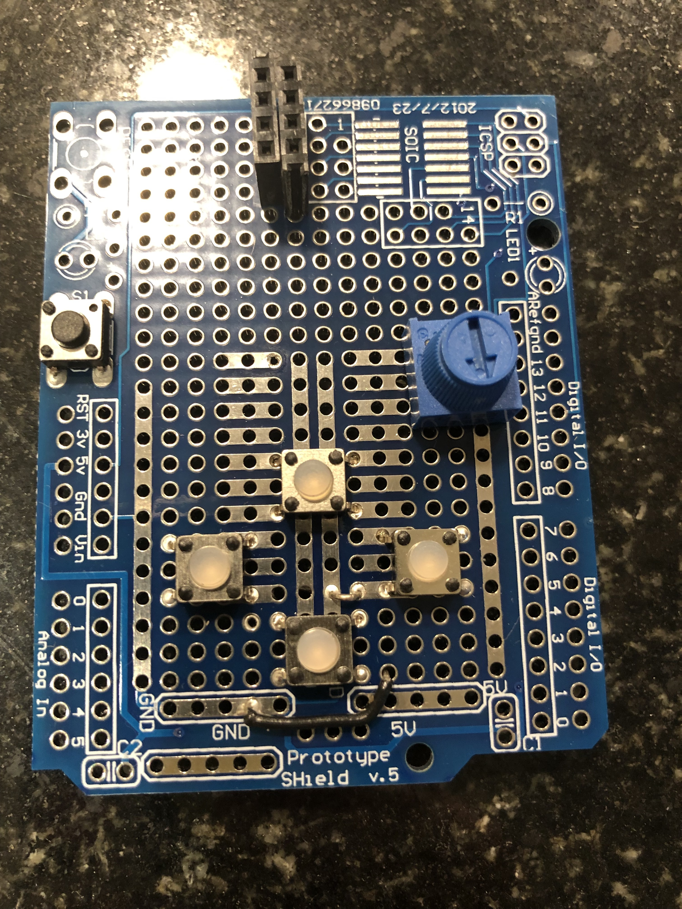

Shortcut to [today's assignment](#todays-assignment)

## New York University Abu Dhabi  
## Interactive Media Program
## Course title: Performing Robots
Course number: IM-UH 2117  
Credit Hours: 4     
Prerequisites: None     

Course website:
[https://github.com/michaelshiloh/PerformingRobots](https://github.com/michaelshiloh/PerformingRobots)  
Instructor: Michael Shiloh mshiloh@nyu.edu
Office hours: By appointment    
Meeting times:    
10:25-11:40 M     
9-11:40 W     
Session: Fall 2021    
[Zoom](https://nyu.zoom.us/j/92630541872)

This is subject to change

### This document: Weekly Schedule

This includes:
- Weekly topic(s)
- Production assignments
- Reading assignments
- Projects

This is all subject to change

### Week 1 (Aug 30 and Sept 1)

Preparations, Basic Electronics, and Introduction to (or Review of) Arduino

#### Assignments Due September 1

Email Assignment:

- Join Discord. Email me if you are missing the invitation.
- Create your github account and repository. Email me a link to your github repository.
- Choose a topic, 
	related to Performing Robots, 
	possibly (but not necessarily) from [this](references.md) list, on which
	you will give a 10 minute presentation later in the semester.
  - Your topic can be an article, a robot, a performance, a book, an artist,
	an event, etc. 
	- Your topic can not be a movie or book of fiction. (e.g. not Wall-E or
	Terminator)
  - Email your topic to me, which I will
  put on our website. You must pick a topic that no one else has chosen.
- Install the Arduino IDE from
	[here](https://www.arduino.cc/en/Main/Software). If you are on Windows chose
	the Windows Installer.
- There is a lot to read for next week, so you might want to start now

#### Assignments Due September 6

Production Assignment:
- Pick up your kit from the bookstore, and the book as well if it's there. (I
	can't remember if we're getting paper or electronic books)
- Prepare a space for working with electronics
	- Have some space to work. There are many small components in the kit that
	will be easily lost, so ideally be seated at a table or desk with clear
	space around you.
	- The kit will include a hot glue gun and a soldering iron. 
		You will need a safe place with an
		electric outlet to work. To protect your work surface from drops of hot
		glue, cover it with cardboard or paper. You will need to keep the hot glue
		gun out of the reach of children or animals.
- You will be building a robot. In order to give each robot its unique
		personality, start collecting cardboard boxes for constructing the robot,
		and varied items that can be glued to your robot. Wooden items such as
		coffee stirrers or popsickle sticks, plastic items like bottle caps, and
		cardboard such as toilet paper tubes are excellent candidates. If you have
		younger siblings consider things like pieces of broken toys and game
		tokens. Look for interesting scraps in your recycling bin and when you
		walk outside.
- Start working on your presentation. We will start presentations on September
	13.

Writing Assignment:

- Read [this](doc/autonomousRobotsAsPerformingAgents.pdf) paper
	- In your Github repository, create a folder named 'september6'
	- In that folder, create a file named 'README.md'
	- In that file, write a response to the paper (about half a page, more if
		you wish)
 
Reading Assignment:

Read, review, or skim as you feel is necessary:
- Sparkfun [breadboard tutorial](https://learn.sparkfun.com/tutorials/how-to-use-a-breadboard/all)
- [Microcontrollers, the basics](https://itp.nyu.edu/physcomp/lessons//microcontrollers-the-basics/)
- [Digital Input & Output](https://itp.nyu.edu/physcomp/lessons//digital-input-output/)
- Read about 
[analog output](https://itp.nyu.edu/physcomp/lessons/analog-output)
- Read about
[analog Input](https://itp.nyu.edu/physcomp/lessons/analog-input/)
- If you are new to functions or want to review, 
watch Dan 
Shiffman's [functions](https://www.youtube.com/watch?v=XCu7JSkgl04&list=PLRqwX-V7Uu6ajGB2OI3hl5DZsD1Fw1WzR) tutorials. There are four videos, each less than 10 minutes.

#### Assignments Due September 13

Production Assignment:

- Prepare a second motor as we did in class. 
	- You might want to watch the
	recording of class to remind youself how to do it.
	- Make sure you pay attention to all the precautions so as not
	to damage the motor or soldering iron, and not to hurt yourselves
	- Test the motor by connecting it directly to a battery
- Connect the second motor to the other side of the H-bridge
- Remove the red wire that went from the 5V pin on Arduino 
	to the 5v on the H-bridge. It is not needed.
- Using the breadboard, connect a switch (pushbutton) to your Arduino
- Write a program that will make both motors turn when you press the switch

Presentations are due, although we will not do them all today

Guidelines for presentations

- Background: 
	The purpose of these presentations is to let us grapple with questions
	about robotic performances, such as:
	- What is a robot? 
	- What is a robot performer?
	- What is a performance?
	- Should robots be in performances? Why or why not?
	- Should robots replace human performers?
	- Should humans replace robot performers?
	- What does a robot performer do better than a human performer? Worse?
- Presentation should be 10-15 minutes long
- Presentation should be demonstrate critical thinking. 
	Don't just report the facts. 
	- What is the context for this presentation?
	- What questions did it raise?
	- How do you feel about it? Do you agree? Did it change your mind? Did it
		make you think about things differently?
- Presentation should end with some questions that will encourage us to think
	about how this presentation affects or changes our
	opinions about robotic performances

#### Assignments Due September 20

Production Assignment:

Build something that you choose to define as a robot
- You may define the word "robot" in any way that you wish
- Your robot must be able to move. You may use any of the motors at your
	disposal. This is only a weekend project so don't be too ambitious.
- Program some sort of sequence into the robot's movements. 
	- The sequence must
		be part of a story (existing or one you made up)
	- The sequence must be at least 10 seconds long
- Upload a video of the robot performing its sequence (Vimeo, Youtube, etc.) 
-Document your project in your Github repository
	- Make a new folder with the name "September20"
	- Upload some process pictures as well as pictures of the final result
	- Create a README.md file with the following information
		- Your definition of the word "robot"
		- Describe your process and include the process pictures
		- Describe the story and how the movement sequence tells it
		- A link to the video
		- Describe any difficulties you had and how you overcame them or worked
			around them
		- Describe anything interesting you learned or discovered
		- Anything else you wish to add

#### Assignments Due September 27

- If you don't already have a spare Arduino and breadboard, 
	reserve one in the IM checkout system .
	- Schedule the pickup for a time of your choosing, but before Monday
- Read
	[this](https://learn.sparkfun.com/tutorials/how-to-use-a-multimeter/all) or
	any other tutorial on using a multimeter
- If you need a review of the servo motor, read 
	[this](https://www.arduino.cc/en/Tutorial/LibraryExamples/Sweep)
	or any other servo motor tutorial

#### Assignments Due September 29
- If you didn't finish it in class, finish soldering the stranded 
	wires to the header socket and on the other end three short pieces of solid
	core wire for breadboard use. Test that your wire assembly works with 
	the `strandtest` example.
- Test that your second Arduino works by uploading the `blink` program 
	from the built-in examples
- Build a circuit with 2 pushbuttons and test that they both work with the
	`digitalReadSerial` built in example
- Using your other Arduino and breadboard, build a circuit with 
		two servo motors and two LEDs. Test both motors and both LEDs with any
		built-in example.
- Solder the USB connector to your second Powerboost and connect it with the
	other switch to the other battery. Test that it works properly.
- Make sure that the switches for both batteries are turned off (Powerboost
	LED should be off).

#### Assignments Due next Monday October 4
-	Get from the lab 10 feet (3 meters) 
	of red and black wires stranded wire during
	open lab hours. The lab assistants have this ready for you to pick up.
	From now on, use only red for 5V and only black for GND.
- Get two alligator cables from the lab, ideally one red and one black
- Start working on your midterm project (described below).
	- Create a new folder called "midtermProject"
	- In that folder create a new file called "journal.md"
	- In the journal describe your idea for your robot. 
		- You may use words and/or pictures (hand drawn is fine).
		- Describe how your robot is going to be expressive
	- Start building your robot 
	- Document your progress in your journal
	- If you have any problems or insights document them
	- It's OK, and in fact expected, to change your design
		as you make progress. Document this in the journal.

#### Midterm project due Wednesday October 13
Built a robot that can be remote controlled

- Your robot can have any shape: anthropomorphic, animal-like, 
	or completely imaginary. Be experimental!
- Your robot must be expressive in some way that an audience will respond to 
	- Might be expressions we're familiar with (happy, sad, fearful, aggressive, shy) or invent your own as long as audience will respond in some way
- You can use any or all the actuators that you have:
	- 6 DC gearmotors
	- 3 servo motors (we will review these in class)
	- NeoPixel matrix
	- Individual LEDs
- The motors can be used for locomotion or for expression; it's up to you
- In addition to the buttons, your remote control (transmitter) can use a
	potentiometer. We will review this in class.
- You should have at least one sequence which is triggered by a button. In
	other words, the button causes the sequence to start, but once started, the
	sequence runs automatically without further input from you until it is
	finished. We will review this in class. The sequence can include the
	NeoPixel matrix.
- Don't spend too much time making your robot look perfect; save that for your
	final project. The goal now is to practice all the technical skills
	(electronics, programming, and construction) you've
	learned and to discover what further knowledge and skills you might need. 

#### Assignments Due Monday October 25

- We will continue with your presentations. 
Please check the updated [schedule](studentPresentations.md) and be prepared.
- You should have received email with a coupon granting you access to 
*Getting Started with Arduino, 3rd Edition*. Redeem that coupon and read
Chapter 8. Automatic Garden-Irrigation System. You don't need to understand
everything in that chapter, what I want you to get out of it is how to work
with an Arduino Prototyping Shield. 
If you have questions about this please discuss on Discord.
This will be a new concept for all of you and I want to familiarize you with
it as much as possible.
- If you were new to soldering when you joined the class, 
read one or both of [these](https://github.com/michaelshiloh/resourcesForClasses#soldering) 
	to improve your skills. We will be doing a lot of critical soldering and I
	want to lessen the chances of failure.
- Create a new folder in your Github repository called "October 25", and in it
	create a file called "README.md", and in that write your response to the
	questions below:
- Choose a short scene from a play and a character in that scene,
	and consider how you would make a robot actor to perform that scene.
	Any spoken words will come from a human or a computer, not from your actor.
	- How would you build the actor? 
	- What technical features will the actor need?
	- How will you construct the actor to create the role?
	- How will you decorate or dress the actor for best effect?
	- What sequence of moves or other actions will you give your actor so that
		they can best play the part?

#### Assignments Due Monday November 1

Read [Chapter 5: Robots: Asleep, Awake, Alone, and in 
  Love](doc/New_Media_Dramaturgy_Performance_Media_and_New-Materialism_5_Robots_Asleep_Awake_Alone_and_in_Love.pdf)
- Be prepared to discuss. Bring questions, observations, reactions to class
	(no need to document on Github)
- Jana and Zhiyang will be our discussion leaders for this. 
- Instructions to the discussion leaders:
	- Read closely, annotate, underline, take notes, list questions, and points
	- Meet, discuss, and answer each other’s questions
	- Prepare about 4-8 insightful questions or discussion points 

#### Assignments Due Monday November 8

1) Read [On Stage: Robots as Performers](doc/On_Stage_Robots_as_Performers.pdf)
- Be prepared to discuss. Prepare questions, observations, and reactions
	**in a short README.md in a new folder called November8 in your Github
	repository.**
- Amina and Yasmin will be our discussion leaders for this. 
- Instructions to the discussion leaders same as last week

2) Propose an idea for a robot play or a scene from a play. 
- Your play may use one or more robots that we will build
- One or two robot dogs (Boston Dynamic Spot)
- Your play may be based on a play that already exists or you may make up
	something on your own
- Consider why a robot should perform in this role. Some suggestions:
	- Can robots be used to explore topics that are too difficult for humans
		(e.g. difficult conversations)?
	- Can robots be used to explore human-robot coexistence (an idea mentioned
		in Katie's presentation today)?
- Write this up in the same README.md mentioned above
- Include sketches or pictures of robots and/or scenery if you wish. 
	Hand drawn is fine.

3) Finish the work we did in class on the prototyping shield:
- 4 pushbuttons
- Two potentiometers
- two rows of 4 header sockets for the radio module
- Connect the leg of the "down" switch and the "right" switch to ground as I
	did in class (review Zoom recording if necessary or ask on Discord)

#### Assignments Due Monday November 15
- Finish wiring up the radio, all 4 switches, and the two potentiometers
- Bring a notebook and your completed shield to class on Monday
- The presentation previously schedule for Monday will be held on Wednesday

#### Assignments Due Wednesday November 17
1) Finish soldering in the 4 feed-through headers

1) Write a play of maximum length about 10 minutes with the working title 
"Snow White and
the 7 Dwarfs" (where the number 7 might change according to how we divide the
robots). Put the play in
	a new folder called November22 in your Github repository.
2) Read 
[Digital Theatre](doc/Masura2020_Book_DigitalTheatre.pdf) 
by Nadja Masura (Chapter 6 "The ‘Other’ Actor") 
- Be prepared to discuss. Prepare questions, observations, and reactions
	in a short README.md in the November22 folder 
- Katie and Coco
	will be our discussion leaders for this. 
- Instructions to the discussion leaders same as last week
3) Get your Remote Control transmitter prototyping shield working fully.

#### Assignments Due Sunday November 28
1) Design your robot in your Github repository, 
in a folder called "finalProject"
- Description and sketches 
- Rough script for your scene. Bullet points are sufficient.
- Add more details as you think of them to the
	[notes](https://docs.google.com/document/d/1UHZr9MYWIdmxLi_zSS8DHFCW8sF6HJgSkXM54YfF8e4/edit)
	we created in class

### todays-assignment
#### Assignments Due Monday December 6
1. Unfortunately there are no open hours at the IM lab during the break. If
you need to get in the lab contact me on Discord. I will be gone for some of
Wednesday-Saturday so for best results try to see me on Tuesday
1. Build your robot and improve your script
	- Make sure to change the address for the radio according to the assignments
		in the
		[notes](https://docs.google.com/document/d/1UHZr9MYWIdmxLi_zSS8DHFCW8sF6HJgSkXM54YfF8e4/edit)
	- As you add features to your robot, expand your script to take advantage of
		these features
	- As you add things to the script, add the necessary capabilities to your
		robot
	- Contact me if you need supplies from the IM lab
	- Contact [Judi](judi.olson@nyu.edu) 
		at the costume shop to get fabric, clothing, accessories, 
		and ideas on how to decorate your robot to give it
		the personality it needs. 
		Judi is an expert in costume design.
		Although the costume shop is closed for the holiday, Judi may open 
		it if necessary.
1. Read 
[Introduction](doc/TheFreudianRobot_DigitalMediaandtheFutureoftheUnconscious_LydiaHLiu/introduction.pdf)
	from *The Freudian Robot: Digital Media and the Future of the Unconscious*
	by Lydia H. Liu (the rest of the book is in the same folder if you are
	curious to read the rest - it is fascinating)
- Be prepared to discuss. Prepare questions, observations, and reactions
	in a short README.md in the November28 folder 
-	Salama and Kyle
	will be our discussion leaders for this. 
- Instructions to the discussion leaders same as before
____________________________________________
unassigned
-	Tori and Rick 
-	Aalya and Jung Soo 

